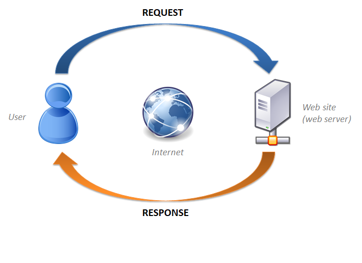
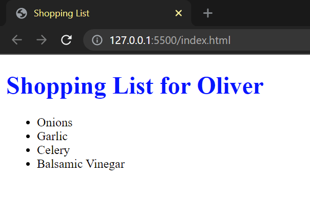
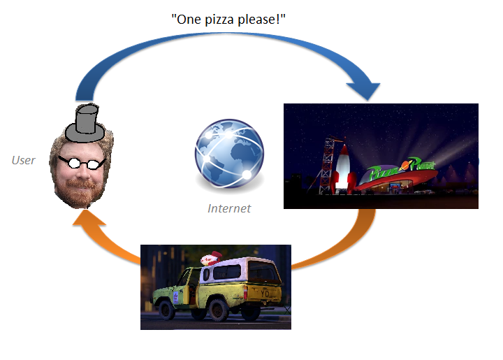

# Backend Vs Frontend: What's The Difference?

> Note to self: turn off notifications **now**! 🙃

Hi, I'm Oliver! I do web dev and dev ops and I also go hiking and occasionally climb/fall off cliffs in my spare time:

In this talk I'll going over an introductory explanation of what we mean when we talk about "the backend" or "the frontend" in the context of web development.

In the process, I'll be running through a little history as well so we can see how we got to where we are today, and maybe a little bit about where we are going...

## This Repo

Through the magic of the internet, this GitHub repo contains code for three different versions of a website. I'm going to be discussing each one through this talk, and when I do you'll be able to browse the code involved for each one. Don't worry if you're not familiar with web development or the specific languages that are in play here - this is an added extra, not a requirement for understanding.

Likewise, the text I've set out in this `readme.md` document is mostly for my own benefit - I'll be referring to it as I talk, but you don't need to read along here unless you find it helps. If you missed seeing me present in person, maybe you'll find it helpful to read through these notes!

Anyway, that's enough groundwork - let's talk web dev!
  

---
 

## Part 0: What A Website Really Is

If you've spent time in the last thirty years using computers, you are no doubt used to the idea that they contain files, and that certain programs that run on those computers can be used to open, read, and manipulate those files. Here's an example: I can open an image file in MS Paint to view/change its contents...

> An improvement, some would say...

 
The key thing to note here is that **a website is just another file**. The program we use to view it in is called a **web browser** (ex: Chrome, Firefox, Edge...). The only difference is that instead of being stored on our computer, websites are stored on *other people's* computers. To access them our computer sends out a request through the internet, and when the website owner's computer gets that request, it responds by sending us the file.

  

The basic file-type that our web browsers display to is is `.html`. These files are written in the HyperText Markup Language, or HTML, and they contain all the information our browser needs to draw the website on the screen. 

> NB: In fact, when we web developers are writing an HTML file, we often separate out all the information related to appearance/style, and put that into another file - a `.css` file. But the browser takes these two files and mashes them together when it draws the website, so that distinction isn't too important here.

 

## Part 1: The Bad Old Days

Here's an example of a **very** simple website that I coded as an HTML/CSS file combo: 
  

You can see the code I wrote for it [here](https://github.com/Hauteclere/backend_vs_frontend/tree/html_only).

Great! So that's how websites work. Case closed. End of topic. Nothing more to say. I guess we can all go home now. ...Right? 

What I just described is the minimum viable configuration for looking at a webpage on your browser. It used to be all we had, back during 90s and early 00s, and for the simple case where I have a website and you want to look at it, it works just fine.

**However**. This has some problems.

1. Every time we want to see a new webpage, we need to request it again. 
1. If I ever want the page you're on to change while you're looking at it, I need to set up some way to convince you to request a fresh copy of it. Maybe there's a button you can click that asks for a different version of the file...?
1. All of the work of creating and distributing the website has to take place on *my* computer! If a lot of people all ask me for different pages, that will be a lot of calculation for my poor little processor... 

If we had to come up with a metaphor for this style of website architecture, we could say that it was like a pizza delivery restaurant. I can call up and order a Hawaiian pizza whenever I want, and the restaurant will prepare it and send someone to bring it to me. If I later decide I want to have a garlic bread as well, I need to phone up again, place a new order, and wait for it to arrive.

> We blew out the production budget for the year on this single image.

It's not the most efficient system, as you can imagine. It tends to result in clunky, bland websites that tie your web server's resources up. But it gets the job done, and it's still used today in simple applications.
  

## Part 2: We Need More Power!
 

Once the internet stopped being something that only defense personel and research academics used, and fell into the hands of the general public, it quickly became apparent that sending bland documents back and forth wasn't going to cut it, and we needed a system with a little bit more oomph. 

In particular, it became clear that to make web pages fun and interactive, we needed a way to allow them to change from moment to moment in response to the way they were used, without having to go through all the rigmarole of sending a request back to the server every time.

The solution to that problem came along in ~1995, with the birth of ✨**Javascript**✨.

Javascript is a true programming language. This sets it apart from HTML and CSS, which are *presentation* languages only. With Javascript, you aren't just limited to describing how things should look - you should define how they are allowed to change, and under what circumstances.

The particularly exciting thing about Javascript is that it is designed to run *in the users's browser*! This is huge, because it means that instead of sending somebody new HTML site every time something needs to change on the screen, we can send them a single HTML file, plus some Javascript. The Javascript will modify the HTML file for us on the fly, changing the user's experience in ways that we programmed into it. Let's look at an example:

> note to self: remember to run `npm install` before running `npm start`, because you're switching branches!

You can take a look at the code that makes this website run [here](https://github.com/Hauteclere/backend_vs_frontend/tree/front_only). It's a significantly more complex that what we had before! That's mainly because it's written using a Javascript tool called `React`. If we really wanted to, we could make it simpler. If you take a look at [this file in particular](https://github.com/Hauteclere/backend_vs_frontend/blob/front_only/examplefrontend/src/components/shoppinglist.js), you might see some similarities.

This is great! Ok, time to pack it all up, people: we fixed the internet!

... Not so fast! We still have one problem left: **I had to include all the information for what should appear on this website when I coded it!**. 

I sat down and said to myself *"I want a website that can have a dark mode or a light mode. In dark mode I want the background to be slate-green, and in light mode I want it to be white."* And then I put all of that information into my Javascript file.

What if later on I want to add a new item to my shopping list? Or, even more useful: what if I want *the users* of the website to be able to add new items to my shopping list for me? This type of website is powerful, but if I want to make a change like that, I'll have to dive back in and re-code it.

This is where the magic happens, baby!
  

## Frontend and Backend - The Website Shall Be Split In Twain!

What we really need is to have a computer somewhere whose job is just to keep track of the information I have included in my website. It can store a list of all the items on my shopping list. We call this a **database**.

Then, when a user accesses the website, the super-powerful javascript that I send them will awaken in their browser, and access that database to find out what items are on my shopping list right now. If I decide to add an item to my list, I'll just add it in the database, and anyone who accesses the website after that will see it appear. 

I can even write my javascript so that it will ask users for new items to add to the list, and then send them to the database as new additions. Then everyone will see the updated list!

And that is where the backend and the frontend come into play! Let's take a look: